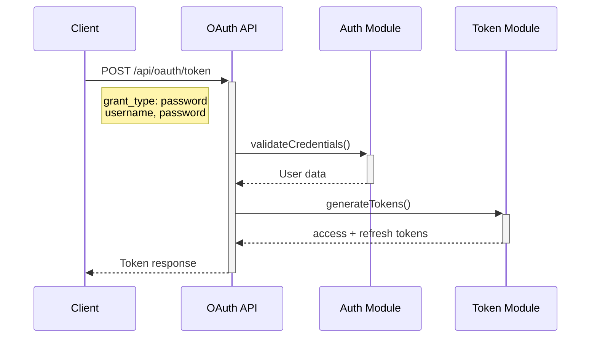
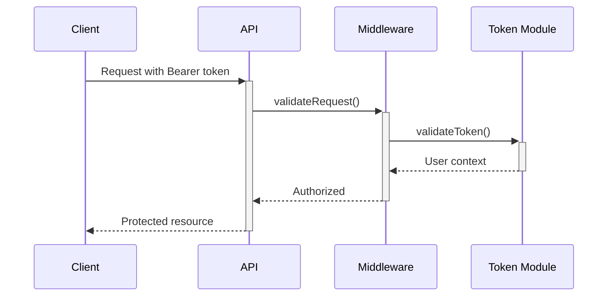
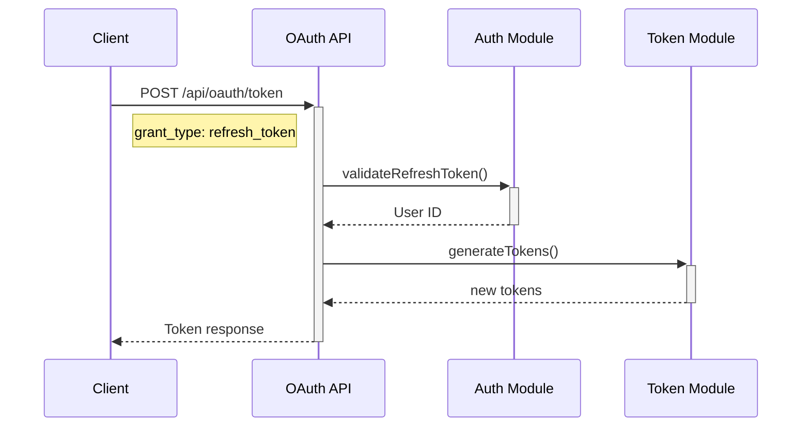

# MediaMath MCP Mock Server

A production-ready mock MCP (Model Context Protocol) server implementing the MediaMath campaign management API specification with OAuth 2.0 authentication.

## Features

- **OAuth 2.0 Authentication** - Mock authentication with Resource Owner Password Grant and Refresh Token flows
- **JWT Token Management** - Secure token generation and validation
- **10 Mock Users** - Pre-configured users across 3 organizations with different roles
- **Role-Based Access Control** - ADMIN, MANAGER, TRADER, ANALYST, and VIEWER roles
- **Next.js 14** - Built with modern App Router and TypeScript
- **Vercel Ready** - Deploy to Vercel with one click

## Quick Start

### 1. Install Dependencies

```bash
npm install
```

### 2. Configure Environment

Copy `.env.example` to `.env.local`:

```bash
cp .env.example .env.local
```

Edit `.env.local` and set your JWT secret:

```env
JWT_SECRET=your-strong-secret-key-here
```

### 3. Start Development Server

```bash
npm run dev
```

Server will start at http://localhost:3000

### 4. Test Authentication

Get an access token:

```bash
curl -X POST http://localhost:3000/api/oauth/token \
  -H "Content-Type: application/json" \
  -d '{
    "grant_type": "password",
    "username": "admin@acme.com",
    "password": "password123",
    "client_id": "mediamath_mcp_client",
    "client_secret": "mock_client_secret",
    "audience": "https://api.mediamath.com"
  }'
```

Response:
```json
{
  "access_token": "eyJhbGciOiJIUzI1NiIsInR5cCI6IkpXVCJ9...",
  "refresh_token": "GEbRxBN...edjnXbL",
  "expires_in": 86400,
  "token_type": "Bearer",
  "scope": "openid profile email"
}
```

## Test Credentials

### Primary Users (Organization 100048 - ACME)

| Email | Password | Role | Permissions |
|-------|----------|------|-------------|
| admin@acme.com | password123 | ADMIN | Full access |
| trader@acme.com | password123 | TRADER | Read all, write campaigns/strategies |
| manager@acme.com | password123 | MANAGER | Manage campaigns/strategies |
| analyst@acme.com | password123 | ANALYST | Read-only access |
| viewer@acme.com | password123 | VIEWER | Limited read access |

### Other Organizations

- **BrandCo (100049):** admin@brandco.com, trader@brandco.com
- **MediaLab (100050):** admin@medialab.com, trader@medialab.com

All passwords: `password123`

### Client Credentials

- **Client ID:** `mediamath_mcp_client`
- **Client Secret:** `mock_client_secret`

## API Endpoints

### OAuth 2.0

- **POST /api/oauth/token** - Request access token
  - Resource Owner Password Grant
  - Refresh Token Grant

See [AUTH_TESTING_GUIDE.md](docs/AUTH_TESTING_GUIDE.md) for detailed API documentation.

## Project Structure

```
mediamath-mcp-mock/
├── src/
│   ├── app/
│   │   └── api/
│   │       └── oauth/
│   │           └── token/
│   │               └── route.ts          # OAuth token endpoint
│   └── lib/
│       └── auth/
│           ├── oauth.ts                  # OAuth flows & user database
│           ├── tokens.ts                 # JWT token management
│           ├── middleware.ts             # Auth middleware
│           └── index.ts                  # Exports
├── docs/
│   ├── IMPLEMENTATION_PLAN.md
│   └── AUTH_TESTING_GUIDE.md            # Authentication guide
├── package.json
├── tsconfig.json
├── .env.example
└── README.md
```

## Available Scripts

- `npm run dev` - Start development server
- `npm run build` - Build for production
- `npm run start` - Start production server
- `npm run lint` - Run ESLint
- `npm run test` - Run tests with Vitest
- `npm run typecheck` - Type check with TypeScript

## Authentication Flow

### 1. Password Grant (Initial Login)



### 2. Using Access Token



### 3. Token Refresh



## Role-Based Permissions

| Role | Read All | Write Campaigns | Write Strategies | Manage Users | Manage Orgs |
|------|----------|-----------------|------------------|--------------|-------------|
| ADMIN | ✅ | ✅ | ✅ | ✅ | ✅ |
| MANAGER | ✅ | ✅ | ✅ | ❌ | ❌ |
| TRADER | ✅ | ✅ | ✅ | ❌ | ❌ |
| ANALYST | ✅ | ❌ | ❌ | ❌ | ❌ |
| VIEWER | Limited | ❌ | ❌ | ❌ | ❌ |

## Organization Write Restrictions

Write operations (create/update campaigns and strategies) are restricted to:
- User's own organization
- Organization ID 100048 only (configurable via `ORG_RESTRICTION_ID`)

This ensures data integrity in the mock environment.

## Development

### Adding New Mock Users

Edit `src/lib/auth/oauth.ts`:

```typescript
export const mockUsers: MockUser[] = [
  // Add new user
  {
    email: 'newuser@example.com',
    password: 'password123',
    userId: 11,
    organizationId: 100048,
    role: 'TRADER',
    firstName: 'New',
    lastName: 'User',
    status: 'active',
    createdAt: new Date().toISOString()
  }
];
```

### Customizing Token Expiration

Edit `src/lib/auth/tokens.ts`:

```typescript
// Change access token expiry (default: 86400 seconds = 24 hours)
export function generateAccessToken(...args, expiresIn: number = 3600) {
  // 1 hour
}

// Change refresh token expiry (default: 30 days)
export function generateRefreshToken(userId: number) {
  const expiresIn = 7 * 24 * 60 * 60; // 7 days
}
```

## Deployment

### Deploy to Vercel

1. Push code to GitHub
2. Import project in Vercel
3. Set environment variables:
   - `JWT_SECRET` - Strong random secret
   - `ENABLE_WRITE_OPERATIONS` - true/false
   - `ORG_RESTRICTION_ID` - 100048

4. Deploy!

### Environment Variables

| Variable | Description | Default |
|----------|-------------|---------|
| JWT_SECRET | Secret key for signing JWTs | mock-jwt-secret... |
| ENABLE_WRITE_OPERATIONS | Enable write operations | true |
| ORG_RESTRICTION_ID | Org ID for write restrictions | 100048 |
| NODE_ENV | Environment | development |

## Security Notes

⚠️ **This is a MOCK server for development/testing only**

- Uses simple password validation (no hashing)
- In-memory token storage (lost on restart)
- Simplified client credential validation
- Not suitable for production use

For production:
- Use proper password hashing (bcrypt)
- Store tokens in Redis/database
- Implement rate limiting
- Add HTTPS requirement
- Use environment-specific secrets
- Add audit logging

## Testing

### Run Unit Tests

```bash
npm run test
```

### Test Coverage

```bash
npm run test:coverage
```

### Manual Testing

See [AUTH_TESTING_GUIDE.md](docs/AUTH_TESTING_GUIDE.md) for comprehensive testing scenarios.

## Troubleshooting

### "Invalid client credentials"
- Check client_id and client_secret in request
- Verify values match mock configuration

### "Invalid username or password"
- Verify email and password are correct
- Check user status is "active"

### "Invalid or expired token"
- Token may have expired (24-hour default)
- Use refresh token to get new access token

### "Module not found" errors
- Run `npm install` to install dependencies
- Check tsconfig.json paths are correct

## Contributing

This is a mock server for the MediaMath MCP project. See [IMPLEMENTATION_PLAN.md](docs/IMPLEMENTATION_PLAN.md) for the full project roadmap.

## License

Private - HyperMindz Internal Project

## Support

For issues or questions, contact the HyperMindz team.
